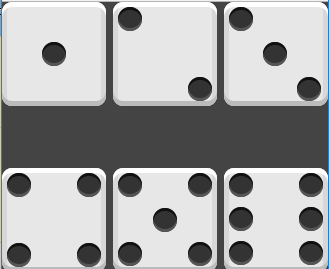

**这是学习Flex的练习和记录**

**Flex container 的属性**

名称|含义|
------------------|-----------
flex-direction | 方向
flex-wrap | 换行
flex-flow | 上面两个的简称
justify-content | 主轴方向对齐方式
align-items | 侧轴对齐方式
align-content | 多行/列内容对齐

**flex item 的属性**

名称|含义
----------|---------
flex-grow | 增长比例（控件过多时）
flex-shrink | 收缩比例（控件不够时）
flex-basis | 默认大小（骰子4）
flex | 上面三个的缩写
order | 顺序（代替双飞翼）
align-self | 自身的对齐方式

align-self 定义单个弹性项目在侧轴上应当如何对齐,会覆盖align-items的设定

[Flex布局教程--阮一峰](http://www.ruanyifeng.com/blog/2015/07/flex-examples.html)

